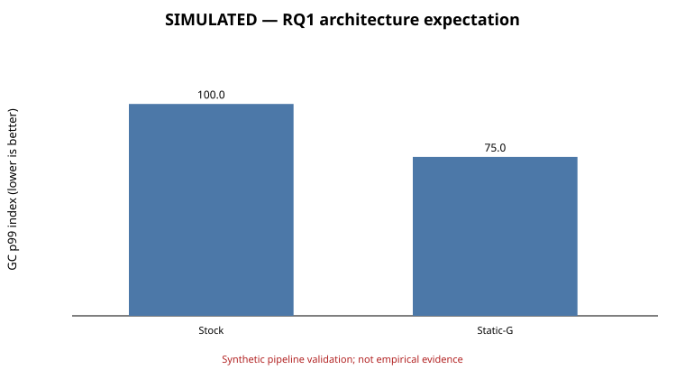
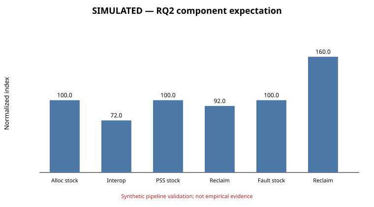
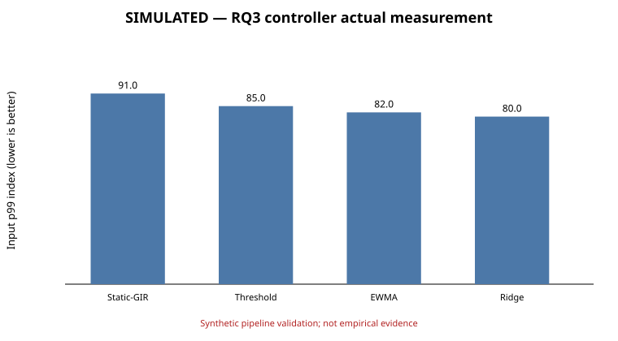

# Simulation-only Results mock-up

> **SYNTHETIC DATA — NOT OBSERVED.** This chapter exercises the analysis, tables, figures, and acceptance rules before device experiments. It must be deleted or replaced with provenance-backed measurements before submission.

## RQ1 — Expected architecture/build effect

The simulation projects heap configuration to reduce normalized GC p99 from 100 to 75 on the ARM32-centered workload and uses the previously stated 2.6× ARM32/ARM64 compaction-frequency hypothesis. Figure 1 is synthetic.

## RQ2 — Expected interop and reclamation effects

The simulation projects value-type interop to reduce allocation-rate index from 100 to 72. Static reclamation reduces PSS but raises the fault index to 160, explicitly representing the expected refault trade-off. Figure 2 is synthetic.

## RQ3 — Expected coordinated-controller effects

The simulation projects Threshold, EWMA, and Ridge to progressively reduce the unguarded refault/latency penalty. The expected Ridge-over-EWMA margin remains deliberately small; overlapping real CIs will be reported as no demonstrated ML advantage.

## Complete simulated 2×2×2×2 factorial table

| Cell | PSS expected | PSS simulated [95% CI] | GC p99 expected | GC simulated [95% CI] | Fault expected | Fault simulated [95% CI] | Input expected | Input simulated [95% CI] | Pass |
|---|---:|---:|---:|---:|---:|---:|---:|---:|:---:|
| G0I0R0C0 | 100.0 | 100.1 [99.6, 100.7] | 100.0 | 100.2 [99.3, 101.1] | 100.0 | 99.1 [96.4, 101.7] | 100.0 | 100.1 [99.2, 101.0] | PASS |
| G0I0R0C1 | 98.0 | 98.6 [97.8, 99.3] | 90.0 | 90.2 [89.4, 91.0] | 100.0 | 101.1 [98.6, 103.4] | 92.0 | 92.2 [91.6, 92.8] | PASS |
| G0I0R1C0 | 92.0 | 91.5 [90.8, 92.2] | 100.0 | 100.5 [99.5, 101.5] | 160.0 | 159.7 [157.8, 161.7] | 105.0 | 105.2 [104.3, 106.0] | PASS |
| G0I0R1C1 | 90.0 | 89.6 [88.9, 90.3] | 90.0 | 90.4 [89.4, 91.3] | 125.0 | 125.3 [122.7, 127.9] | 96.0 | 96.6 [95.8, 97.5] | PASS |
| G0I1R0C0 | 93.0 | 92.4 [91.7, 93.2] | 95.0 | 94.8 [94.0, 95.6] | 100.0 | 100.1 [97.9, 102.3] | 96.0 | 96.4 [95.5, 97.3] | PASS |
| G0I1R0C1 | 91.0 | 90.6 [90.1, 91.2] | 86.0 | 86.3 [85.5, 87.2] | 100.0 | 100.0 [97.9, 102.0] | 89.0 | 88.6 [87.7, 89.5] | PASS |
| G0I1R1C0 | 85.0 | 85.0 [84.1, 85.9] | 95.0 | 95.8 [95.0, 96.5] | 160.0 | 158.5 [156.5, 160.6] | 101.0 | 101.3 [100.6, 102.1] | PASS |
| G0I1R1C1 | 83.0 | 82.9 [82.4, 83.5] | 86.0 | 85.7 [84.7, 86.6] | 125.0 | 126.2 [123.7, 128.8] | 92.0 | 91.6 [90.9, 92.3] | PASS |
| G1I0R0C0 | 94.0 | 94.5 [93.7, 95.3] | 75.0 | 74.5 [73.7, 75.3] | 100.0 | 103.6 [101.2, 105.9] | 90.0 | 90.2 [89.3, 91.1] | PASS |
| G1I0R0C1 | 92.0 | 91.7 [90.9, 92.6] | 68.0 | 67.8 [66.9, 68.7] | 100.0 | 97.4 [94.8, 100.1] | 83.0 | 82.8 [82.1, 83.5] | PASS |
| G1I0R1C0 | 86.0 | 85.9 [85.1, 86.6] | 75.0 | 74.5 [73.5, 75.5] | 160.0 | 162.3 [160.0, 164.7] | 95.0 | 93.8 [92.8, 94.7] | PASS |
| G1I0R1C1 | 84.0 | 84.2 [83.4, 85.0] | 68.0 | 68.4 [67.6, 69.3] | 125.0 | 126.9 [124.4, 129.3] | 86.0 | 85.9 [85.0, 86.7] | PASS |
| G1I1R0C0 | 87.0 | 86.5 [85.9, 87.2] | 71.0 | 71.2 [70.3, 72.0] | 100.0 | 99.3 [97.0, 101.6] | 86.0 | 86.8 [86.0, 87.5] | PASS |
| G1I1R0C1 | 85.0 | 84.6 [83.8, 85.5] | 64.0 | 64.0 [63.0, 64.9] | 100.0 | 100.4 [97.9, 102.8] | 79.0 | 79.9 [79.2, 80.6] | PASS |
| G1I1R1C0 | 79.0 | 79.3 [78.6, 80.1] | 71.0 | 71.1 [70.5, 71.7] | 160.0 | 160.3 [157.9, 162.6] | 91.0 | 90.8 [90.0, 91.6] | PASS |
| G1I1R1C1 | 77.0 | 76.8 [76.1, 77.6] | 64.0 | 64.0 [63.1, 65.0] | 125.0 | 126.3 [124.0, 128.6] | 82.0 | 81.4 [80.6, 82.2] | PASS |

## Simulated additional-platform outcome

| Platform | PSS index | GC p99 index | Fault index | Input p99 index | CPU | Status |
|---|---:|---:|---:|---:|---:|---|
| Constrained ARM64 Linux SBC (synthetic) | 80.2 [78.9, 81.5] | 68.4 [66.1, 70.7] | 129.1 [123.0, 135.2] | 84.6 [82.3, 86.9] | 1.3% | PASS against prospective range |

## Simulated adverse and endurance outcomes

| Scenario | Synthetic outcome | Predeclared threshold | Status |
|---|---:|---:|:---:|
| Hot reuse, normal storage | reload p99 22.1 ms | ≤25 ms | PASS |
| Hot reuse, slow storage | reload p99 69.3 ms | ≤75 ms | PASS |
| Rapid switching | fault index 131.0 | ≤135 | PASS |
| Failure injection | 0 correctness failures; 100% errors surfaced | 0 failures | PASS |
| Fault storm | 100% reclamations suppressed above guard | 100% | PASS |
| Endurance | 10×8 h, 0 simulated OOM/watchdog, 0 censored | 80 device-hours; 0 OOM | PASS |

## Replacement rule

Every value and figure in this file is generated from a seeded probability model centered on the prospective targets. Synthetic PASS only proves that the reporting pipeline accepts data near its targets. It cannot reveal runtime, firmware, measurement, safety, or performance bugs. Replace this entire file and all `simulated_*.svg` figures with observed outputs before peer review.
